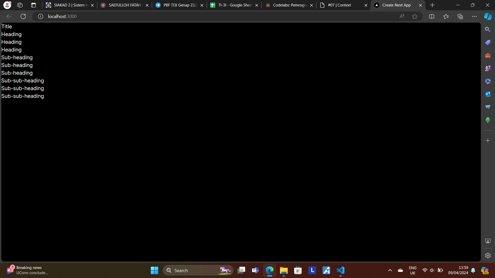
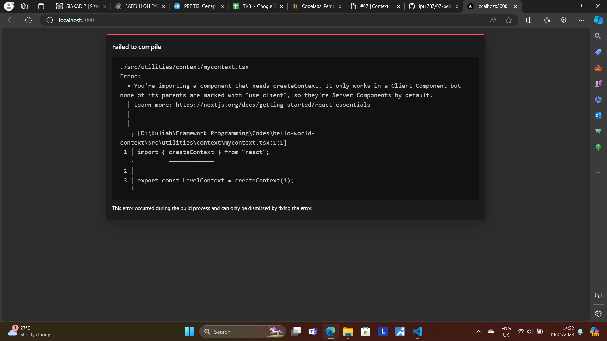
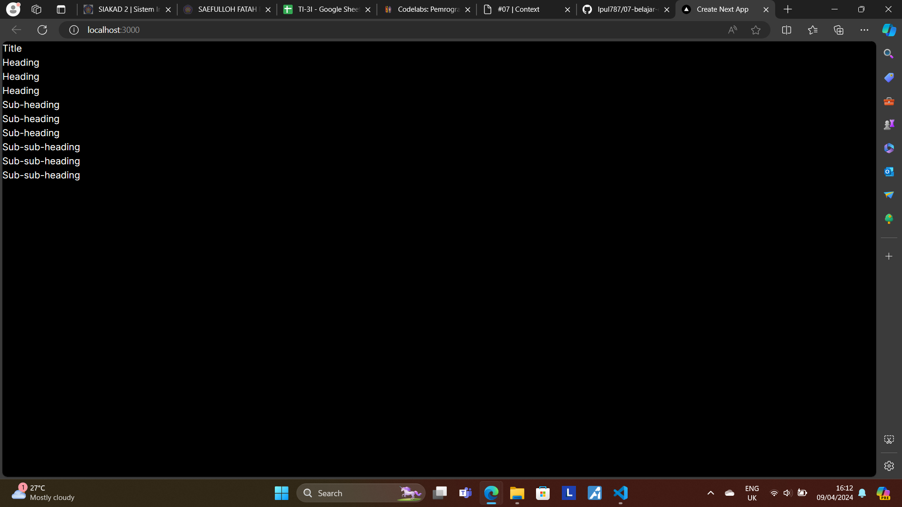
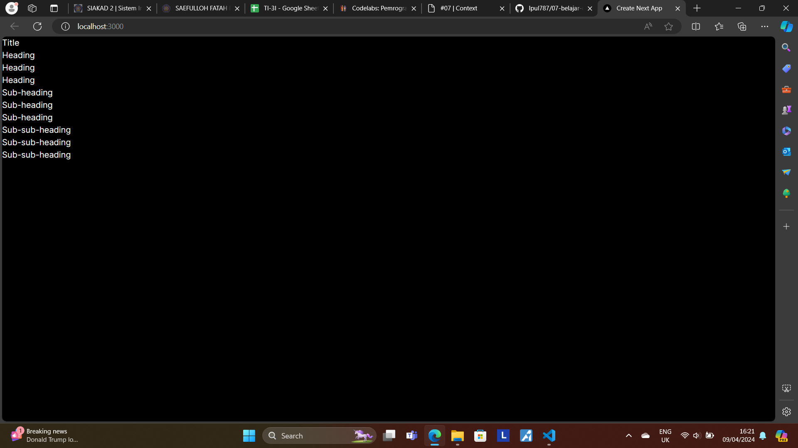
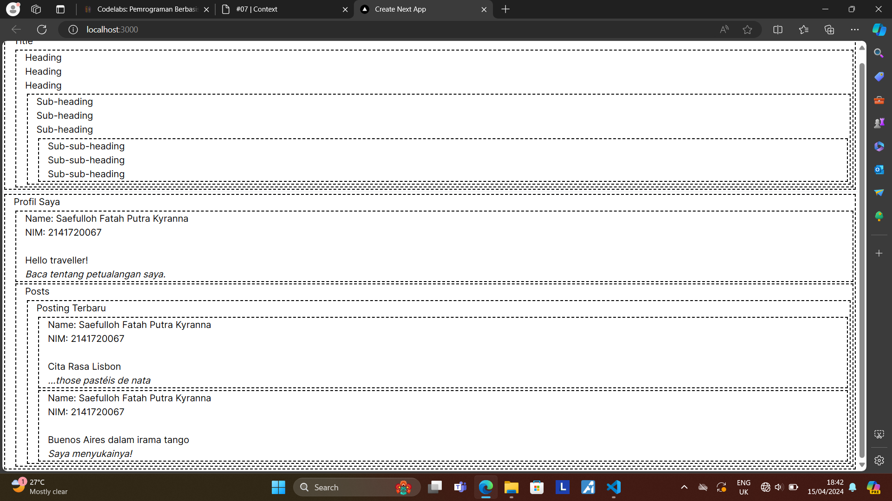
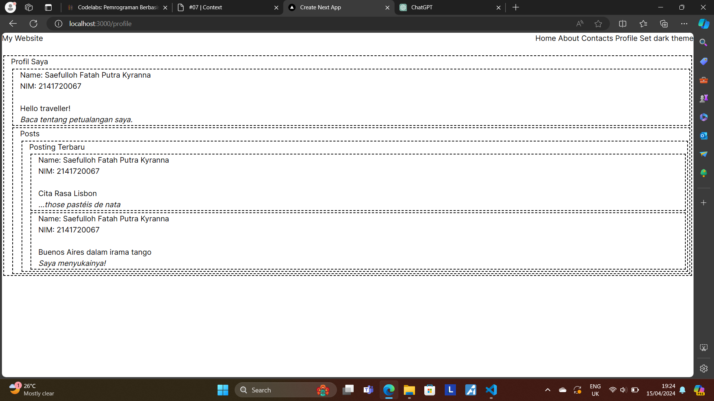
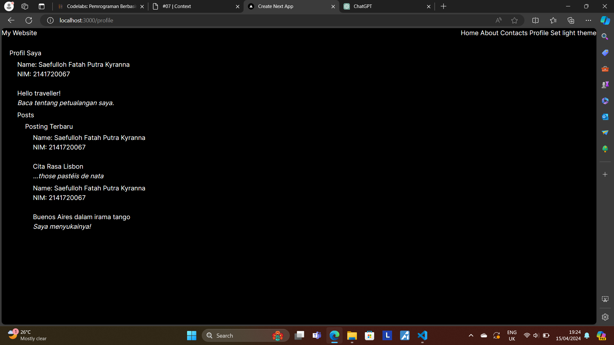

This is a [Next.js](https://nextjs.org/) project bootstrapped with [`create-next-app`](https://github.com/vercel/next.js/tree/canary/packages/create-next-app).

## Getting Started

First, run the development server:

```bash
npm run dev
# or
yarn dev
# or
pnpm dev
# or
bun dev
```

Open [http://localhost:3000](http://localhost:3000) with your browser to see the result.

You can start editing the page by modifying `app/page.tsx`. The page auto-updates as you edit the file.

This project uses [`next/font`](https://nextjs.org/docs/basic-features/font-optimization) to automatically optimize and load Inter, a custom Google Font.

## Practicum Report

|  | Framework Based Programming 2024 |
|--|--|
| NIM |  2141720067|
| Nama |  Saefulloh Fatah Putra Kyranna |
| Kelas | TI - 3I |

## Answer of Question No. 1

Output: 



The display of the website reveals the level of the heading and sections in the main page. This is done by the use of context which provides necessary components from a child component to the parent component. 

## Answer of Question No. 2

The initial run of the website results in the following error. 



This is because the `createContext` function only works in the Client component instead of the Server component which is normally created in Next.js. Therefore, we need to modify the entire file (`mycontext.tsx`, `heading.tsx`, `section.tsx`) with the `'use client'` code. 

Output: 



## Answer of Question No. 3

Output: 



## Answer of Question No. 4

Output of webpage: 



## Answer of Question No. 5

Output with light theme: 



Output with dark theme:



1. The toggle button is working as expected and no error is encountered. 

2. If we refresh the website after changing page and theme, it will not be permanent because we did not initiate localStorage or cookies method. If we initiate that, we will be able to store our recent changes to the theme and page even after website refresh. To do this, we will change the `myapp.tsx` to initiate localStorage first: 

```
export default function MyApp({ Component, pageProps }: { Component: any, pageProps: any} ){
    const [theme, setTheme] = useState(() => {
        const savedTheme = localStorage.getItem('theme');
        return savedTheme ? JSON.parse(savedTheme) : themes.light;
    });

    useEffect(() => {
        localStorage.setItem('theme', JSON.stringify(theme));
    }, [theme]);

    const toggleTheme = () => {
        setTheme(theme === themes.dark ? themes.light : themes.dark);
    };

    return (
        <ThemeContext.Provider value={{theme, toggleTheme}}>
            <div
            style={{
                width: '100%',
                minHeight: '100vh', 
                ...theme,
            }}>
            <Navbar />
            <Component {...pageProps}/>
            </div>
        </ThemeContext.Provider>
    )
}
```

In this way, we will be able to store changes made in the page or in the theme locally. 